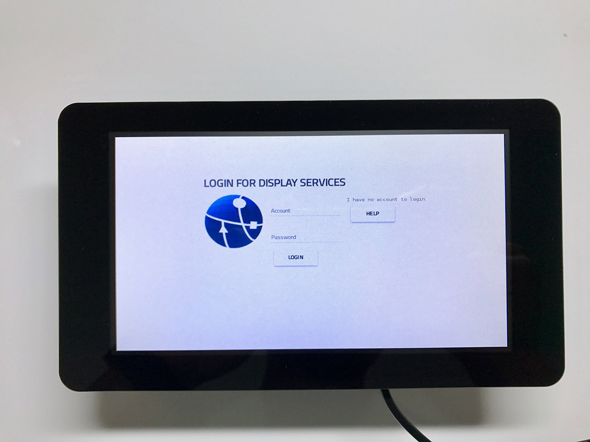
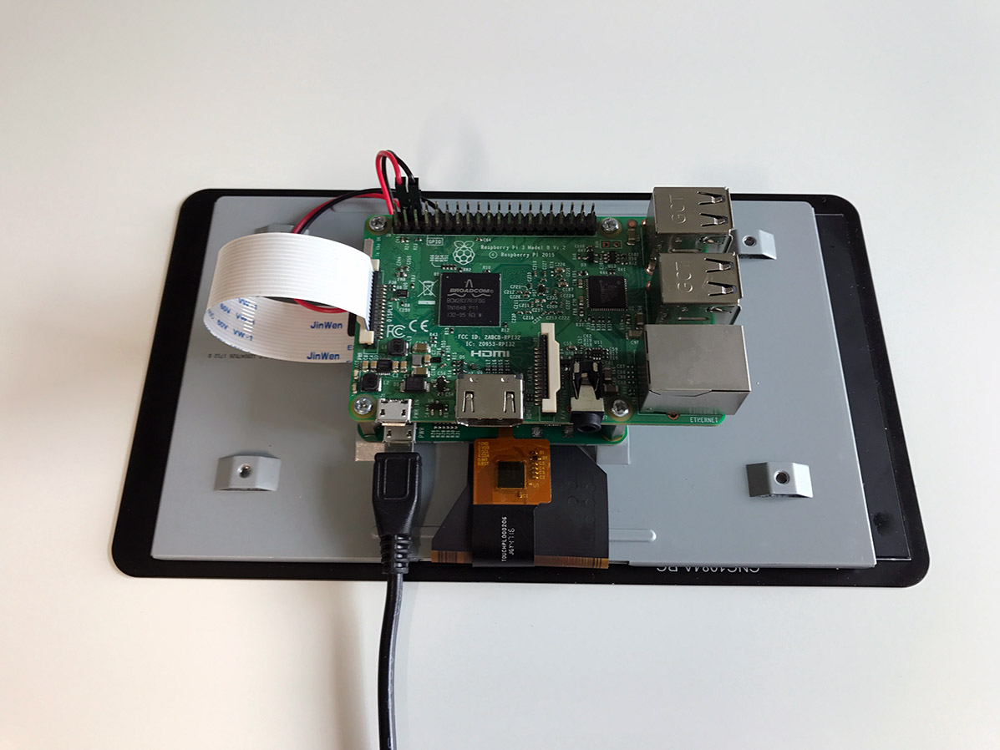

# thing-it-device-browser

[[thing-it-node]](https://github.com/marcgille/thing-it-node/) Device Plugin for a custom Website that allows you to display and interact with the [[thing-it]](http://www.thing-it.com) universe via the [official Raspberry Pi 7" touchscreen display](https://github.com/marcgille/thing-it-node/)

*
*

## Setup
**[thing-it-device-browser]** is currently tested only on a Raspberry Pi 3. It may works on other versions of Raspberry but the installation process may differ from the following.
### Hardware
Follow the instructions on XXX to Connect your Touchscreen to your Raspberry Pi 3.

**Note:** Make sure your power supply delivers enough power for your Pi and your Touchscreen. 

### Software

#### Image
The easiest way to use **[thing-it-device-browser]** is to download one of our preinstalled **[thing-it-node-image-display]**. These image comes with full out of the Box support for the offiziell 7" Raspberry Pi Display.

#### Raspbian Lite

#### Raspbian with GUI

## User Interface
adasdasd
